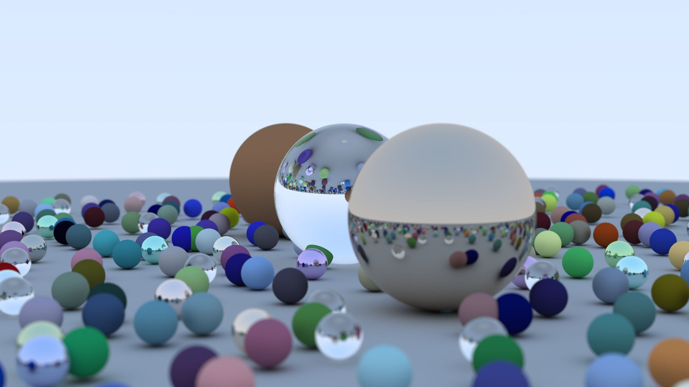

# win32-raytracer
</img>

My implementation from Peter Shirley's Ray Tracing in one Weekend book:  
http://in1weekend.blogspot.com/2016/01/ray-tracing-in-one-weekend.html

Simple UI using dear imgui (using DirectX 11 backend)  
https://github.com/ocornut/imgui

## Features:
+ Diffuse (lambertian), metal, glass (dielectric) materials
+ Antialiasing, depth of field
+ SIMD/AVX ray intersection tests
+ SIMD random number generator
+ Multi-threaded rendering
